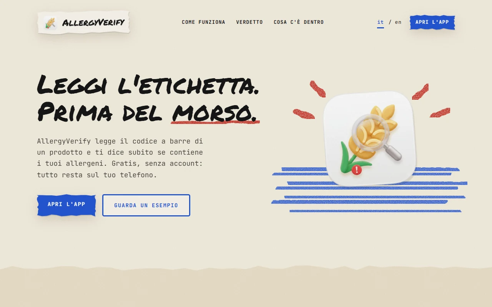
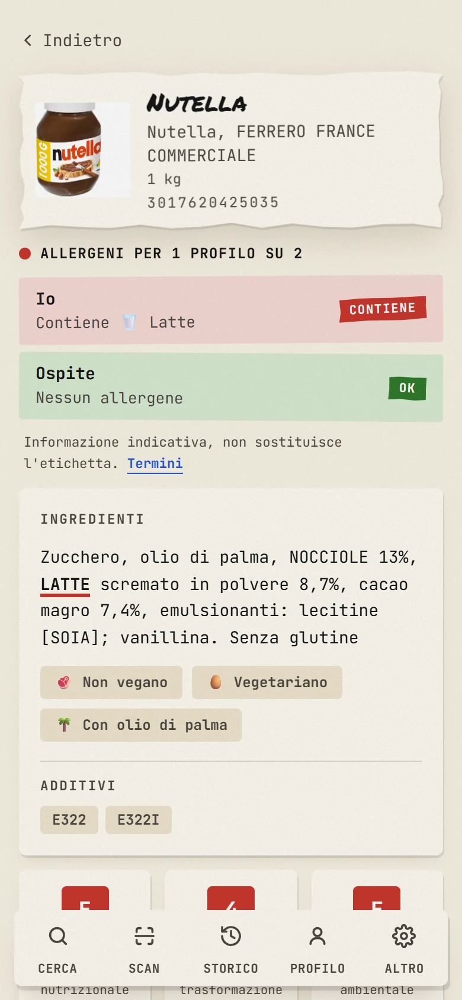
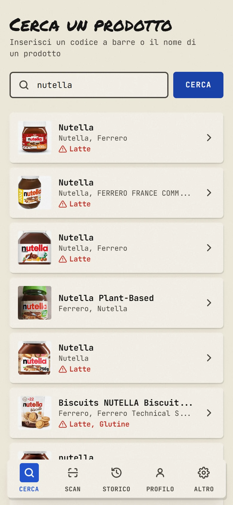
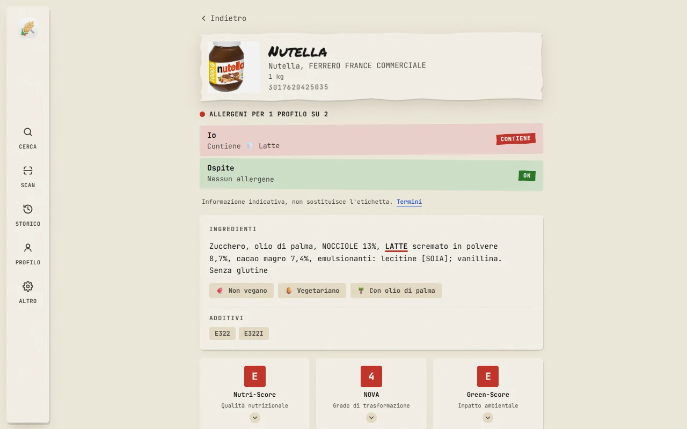

<p align="center">
  
</p>

<h1 align="center">AllergyVerify</h1>

<p align="center">Scansiona o cerca un prodotto alimentare e scopri subito se contiene i tuoi allergeni, in base al tuo profilo personale. Un sito con la landing e, su <code>/app/</code>, la PWA installabile: mobile-first, utilizzabile anche da desktop.</p>

<p align="center"><strong>Sito</strong>: <a href="https://allergyverify.vercel.app">allergyverify.vercel.app</a> · <strong>App</strong>: <a href="https://allergyverify.vercel.app/app/">allergyverify.vercel.app/app/</a></p>

<p align="center">
  <a href="https://github.com/Fedanco/AllergyVerify/actions/workflows/ci.yml"></a>
  
  
  
  
  
</p>

<p align="center">
  
</p>

|                              Verdetto con i timbri                              |                              Ricerca                              |                                  Desktop                                  |
| :------------------------------------------------------------------------------: | :----------------------------------------------------------------: | :--------------------------------------------------------------------------: |
|  |  |  |

## Funzionalità

- 🔍 **Ricerca** per codice a barre o per nome prodotto
- 📷 **Scansione** del codice a barre con la fotocamera (direttamente dal browser)
- ⚠️ **Verdetto allergie**: un timbro CONTIENE / TRACCE / OK per ogni profilo attivo (14 allergeni UE), con gli allergeni sottolineati nella lista degli ingredienti
- 📊 **Valori nutrizionali** per 100 g, con Nutri-Score / NOVA / Green-Score
- 🕘 **Storico** di scansioni e ricerche
- 👤 **Profili allergie** multipli, salvati solo sul dispositivo — con più profili attivi il verdetto mostra una riga per persona
- 🌍 **Multilingua** italiano/inglese, con traduzione automatica degli ingredienti

## Design

Sito e app condividono la stessa direzione visiva, **"carta e pennarello"**: fondo di carta, fogli piatti con l'ombra dura, cartellini strappati per le cose che contano, titoli scritti a mano (Permanent Marker) e tutto il resto in JetBrains Mono. Un solo tema, chiaro. Il verdetto è un timbro (rosso CONTIENE, grano TRACCE, verde OK) e non un colore sul testo: i nomi degli allergeni restano sempre in inchiostro, leggibili senza errori. Token, utility e componenti della carta vivono in `src/paper/`, usati da entrambe le pagine.

## Struttura del progetto

```
index.html    landing page (entry Vite; il codice sta in src/landing/)
privacy/      pagina Privacy del sito (altra entry dello stesso build)
terms/        pagina Termini del sito (idem)
app/          entry HTML dell'app, servita su /app/
src/          codice sorgente dell'app (componenti, pagine, dati, i18n, hook)
src/landing/  codice della landing (sezioni, disegni SVG, dizionario proprio)
src/paper/    design system "carta" condiviso da landing e app
public/       asset statici serviti così come sono (icone PWA, favicon, anteprima social)
assets/       sorgente grafica non pubblicata (logo)
docs/         documentazione pubblica (screenshot del README)
scripts/      script di supporto (icone dal logo sorgente, screenshot del README)
```

## Dati e privacy

- Dati prodotto da [Open Food Facts](https://world.openfoodfacts.org) (database libero e collaborativo), richiesti con `?fields=` ridotti e cache locale 24h.
- Nessun backend, nessun account: profili e storico vivono in `localStorage`.

> ⚠️ Le informazioni possono essere incomplete: in caso di allergie gravi verifica sempre l'etichetta del prodotto.

## Sviluppo

```bash
npm install
npm run dev       # server di sviluppo su http://localhost:5173
npm run build     # build di produzione in dist/
npm run preview   # anteprima della build
npm run lint      # oxlint
```

Stack: Vite · React · TypeScript · Tailwind CSS 4 · react-router · @zxing/browser · font Permanent Marker e JetBrains Mono via @fontsource

Gli screenshot in `docs/screenshots/` si rigenerano con `node scripts/readme-screenshots.mjs` (istruzioni in testa allo script).

## Deploy

Il sito è pubblicato su **Vercel**: https://allergyverify.vercel.app

Deploy manuale dalla cartella del progetto: `npx vercel --prod`. Con la Git integration di Vercel attiva, ogni push su `main` viene pubblicato automaticamente (dopo che la CI su GitHub Actions ha verificato lint e build).

## Licenza

Distribuito con licenza MIT. Vedi [LICENSE](LICENSE).
