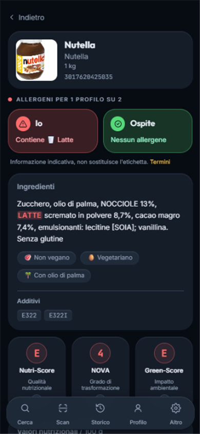
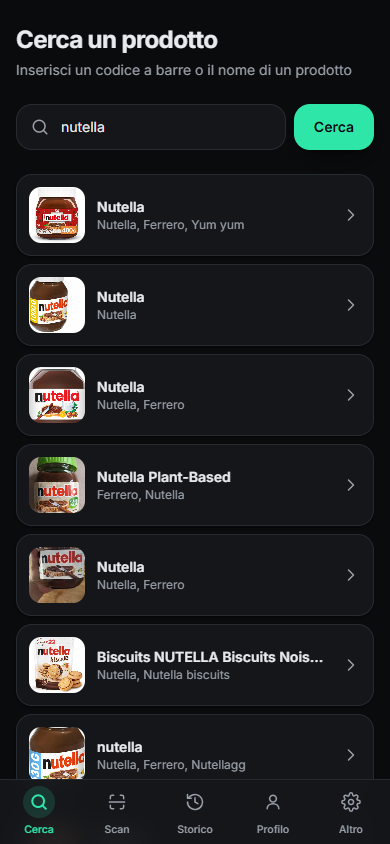
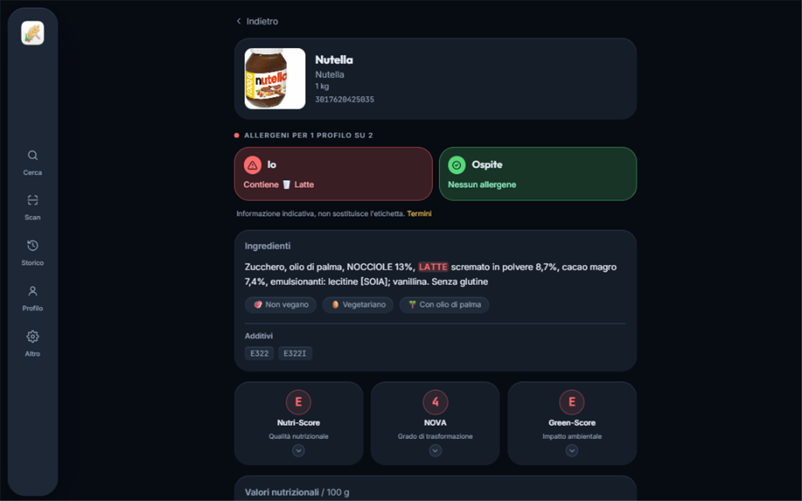

<p align="center">
  
</p>

<h1 align="center">AllergyVerify</h1>

<p align="center">Scansiona o cerca un prodotto alimentare e scopri subito se contiene i tuoi allergeni, in base al tuo profilo personale. PWA installabile, mobile-first, utilizzabile anche da desktop.</p>

<p align="center"><strong>Demo live</strong>: <a href="https://allergyverify.vercel.app">allergyverify.vercel.app</a></p>

<p align="center">
  <a href="https://github.com/Fedanco/AllergyVerify/actions/workflows/ci.yml"></a>
  
  
  
  
  
</p>

|                                     Verdetto allergeni                                     |                              Ricerca                              |                                  Desktop                                  |
| :------------------------------------------------------------------------------------------: | :----------------------------------------------------------------: | :--------------------------------------------------------------------------: |
|  |  |  |

## Funzionalità

- 🔍 **Ricerca** per codice a barre o per nome prodotto
- 📷 **Scansione** del codice a barre con la fotocamera (direttamente dal browser)
- ⚠️ **Verdetto allergie**: banner rosso/verde in base al profilo attivo (14 allergeni UE)
- 📊 **Valori nutrizionali** per 100 g, con Nutri-Score / NOVA / Green-Score
- 🕘 **Storico** di scansioni e ricerche
- 👤 **Profili allergie** multipli, salvati solo sul dispositivo — con più profili attivi il verdetto mostra una scheda per persona
- 🌍 **Multilingua** italiano/inglese, con traduzione automatica degli ingredienti

## Struttura del progetto

```
src/          codice sorgente (componenti, pagine, dati, i18n, hook)
public/       asset statici serviti così come sono (icone PWA, favicon)
assets/       sorgente grafica non pubblicata (logo)
docs/         documentazione pubblica (screenshot del README)
scripts/      script di supporto (rigenerazione icone dal logo sorgente)
```

## Dati e privacy

- Dati prodotto da [Open Food Facts](https://world.openfoodfacts.org) (database libero e collaborativo), richiesti con `?fields=` ridotti e cache locale 24h.
- Nessun backend, nessun account: profili e storico vivono in `localStorage`.

> ⚠️ Le informazioni possono essere incomplete: in caso di allergie gravi verifica sempre l'etichetta del prodotto.

## Sviluppo

```bash
npm install
npm run dev       # server di sviluppo su http://localhost:5173
npm run build     # build di produzione in dist/
npm run preview   # anteprima della build
npm run lint      # oxlint
```

Stack: Vite · React · TypeScript · Tailwind CSS 4 · react-router · @zxing/browser

## Deploy

Il sito è pubblicato su **Vercel**: https://allergyverify.vercel.app

Deploy manuale dalla cartella del progetto: `npx vercel --prod`. Con la Git integration di Vercel attiva, ogni push su `main` viene pubblicato automaticamente (dopo che la CI su GitHub Actions ha verificato lint e build).

## Licenza

Distribuito con licenza MIT. Vedi [LICENSE](LICENSE).
